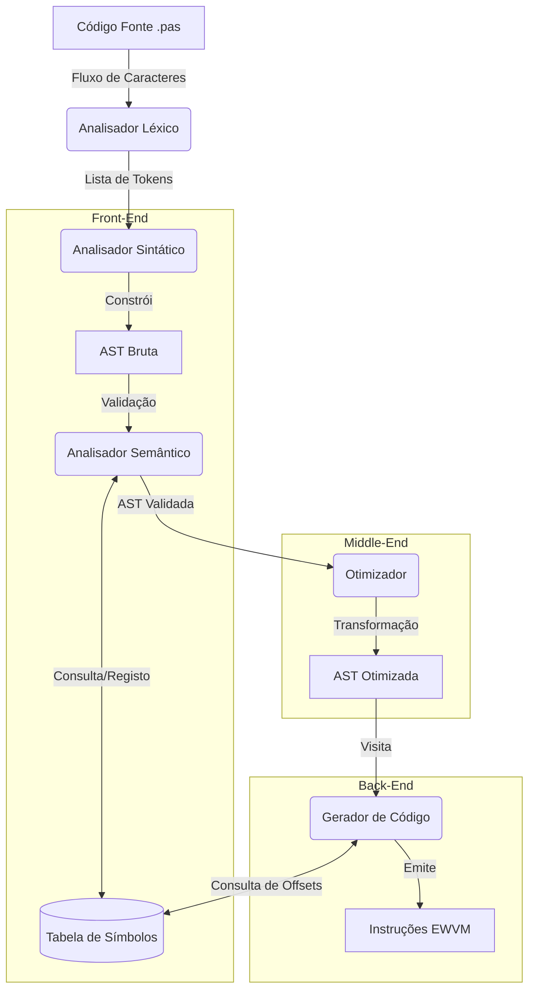
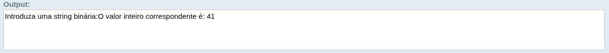

# Construção de um Compilador para Pascal Standard

## Projeto de Processamentos de Linguangem e Compiladores
**Grupo 10** -  Ivo Sousa `a102935`, Miguel Páscoa `a104244`, Ricardo Cerqueira `a102878`

## 1. Introdução

No âmbito da unidade curricular de Processamento de Linguagens e Compiladores, foi proposto o desenvolvimento de um compilador para a linguagem Pascal Standard. Este projeto tem como objetivo fundamental a criação de uma ferramenta capaz de analisar, interpretar e traduzir código fonte Pascal para um formato destinado a uma Máquina Virtual ([EWVM](https://ewvm.epl.di.uminho.pt/)) disponibilizada para o efeito.

O desenvolvimento do compilador obedeceu a uma arquitetura modular, dividida em cinco etapas fundamentais descritas no enunciado do projeto:

1. **Análise Léxica:** Implementação de um analisador léxico (lexer) responsável pela conversão do código fonte numa lista de tokens, identificando palavras-chave, identificadores e símbolos. Para esta etapa, recorreu-se à ferramenta `ply.lex`.

2. **Análise Sintática:** Construção de um analisador sintático (parser) para validar a estrutura gramatical do código face às regras da linguagem Pascal, utilizando a ferramenta `ply.yacc`.

3. **Análise Semântica:** Verificação da coerência do código, incluindo a validação de tipos de dados e a correta declaração de variáveis.

4. **Otimização de Código:** Simplificação da AST através de técnicas como *Constant Folding* e eliminação de código morto, visando melhorar a eficiência do programa final.

5. **Geração de Código:** Conversão do programa reconhecido e validado para as instruções suportadas pela Máquina Virtual alvo.

Este relatório descreve detalhadamente a implementação de cada um destes módulos, as decisões de desenho tomadas (como a gestão de memória e tratamento de erros) e os testes realizados para validar a correção da solução.

## 2. Arquitetura do Compilador

O compilador foi desenhado seguindo uma arquitetura modular em *pipeline*, onde cada estágio transforma a representação do programa fonte numa estrutura de nível mais baixo ou mais abstrato, até à geração do código final. A implementação foi realizada em **Python 3**, tirando partido da sua tipagem dinâmica para a construção flexível da árvore sintática e da biblioteca **PLY (Python Lex-Yacc)** para a geração dos analisadores léxico e sintático.

A comunicação entre os módulos é sequencial, garantindo o desacoplamento entre as fases de análise (*Front-end*) e as fases de síntese (*Back-end*).

### 2.1. Diagrama de Fluxo de Dados

O fluxo de processamento inicia-se com a leitura do ficheiro de texto e termina com a emissão de instruções para a pilha da máquina virtual (Stack Machine). O diagrama seguinte ilustra as dependências e os artefactos produzidos em cada fase:



### 2.2. Estruturas de Dados Fundamentais

A robustez do compilador baseia-se em três estruturas de dados principais que transportam a informação ao longo do pipeline:

#### 2.2.1. Tokens (Unidades Léxicas)

A interface entre o lexer e o parser. Cada token não é apenas uma string, mas um objeto complexo que armazena:
- **Tipo:** A categoria gramatical (ex: `INTEGER_CONST`, `WHILE`, `ID`).
- **Valor:** O conteúdo semântico (ex: o valor numérico `42` ou o nome da variável `soma`).
- **Metadados:** Informação de contexto (número da linha e coluna) essencial para mensagens de erro precisas.

#### 2.2.2. Árvore Sintática Abstrata (AST)

A AST é a estrutura central do projeto. Ao contrário de uma *Parse Tree* concreta, a AST abstrai detalhes sintáticos desnecessários (como `;` ou *parênteses*) e foca-se na estrutura lógica do programa. Implementada através da classe `Node` no ficheiro `parser.py`, a árvore possui uma estrutura heterogénea e recursiva:
- **Nós de Controlo:** Como `IfStatement` ou `WhileStatement`, que gerem o fluxo de execução.
- **Nós de Expressão:** Como `BinaryOp`, que representam cálculos e retornam valores.
- **Nós de Declaração:** Que introduzem novos símbolos no programa.

#### 2.2.3. Tabela de Símbolos Hierárquica

Utilizada transversalmente pela Análise Semântica e pela Geração de Código, a Tabela de Símbolos é responsável pela gestão de escopos e memória.
- **Hierarquia:** Implementada como uma lista ligada de tabelas (Escopo Atual $\to$ Escopo Pai $\to$ ... $\to$ Escopo Global), permitindo o *shadowing* de variáveis (variáveis locais ocultarem globais).
- **Conteúdo:** Armazena o tipo de dado (para verificação de compatibilidade), a categoria (variável, função, parâmetro) e, crucialmente para a geração de código, o offset de memória (endereço relativo na pilha da VM).

### 2.3. Gestão Transversal de Erros

O compilador implementa estratégias distintas de tratamento de erros para cada fase, visando fornecer o máximo de informação ao utilizador sem abortar prematuramente a execução:
1. **Erros Léxicos:** O analisador descarta caracteres inválidos e continua a varredura, acumulando erros numa lista.
2. **Erros Sintáticos:** Utilização do mecanismo de *Panic Mode*, descartando *tokens* até encontrar um ponto de sincronização seguro (como um `;` ou `end`), permitindo verificar o resto do ficheiro.
3. **Erros Semânticos:** Recolha de erros de tipagem e declaração numa lista acumulativa, reportando todas as inconsistências lógicas no final da passagem pela AST.

## 3. Fases de Implementação

### 3.1. Análise Léxica (`lexer.py`)

A primeira etapa do compilador é a análise léxica, responsável por ler o fluxo de caracteres do código-fonte e agrupá-los em unidades significativas chamadas *tokens*. Conforme estabelecido nos requisitos do projeto, este módulo foi implementado utilizando a biblioteca `ply.lex` do Python.

O analisador léxico foi desenvolvido no ficheiro `lexer.py` e tem como principais responsabilidades a identificação de palavras-chave, identificadores, literais (números e *strings*), operadores e símbolos de pontuação, bem como o descarte de comentários e espaços em branco.

#### 3.1.1. Definição de Tokens e Palavras Reservadas

Para garantir a extensibilidade e organização do código, as palavras reservadas da linguagem (como `PROGRAM`, `BEGIN`, `VAR`, `IF`, etc.) foram definidas num dicionário separado. Isto permite que o analisador verifique se um identificador capturado é, na verdade, uma palavra reservada.

A lista completa de *tokens* inclui:
* **Palavras-chave:** Mapeadas a partir do dicionário `reserved` (ex: `while` $\to$ `WHILE`).
* **Identificadores:** Reconhecidos pela *tag* `ID`.
* **Literais:** Constantes inteiras (`INTEGER_CONST`), reais (`REAL_CONST`) e cadeias de caracteres (`STRING_CONST`).
* **Operadores e Pontuação:** Símbolos aritméticos, lógicos e delimitadores (ex: `:=` como `ASSIGN`, `..` como `DOTDOT`).

#### 3.1.2. Regras de Expressões Regulares e Prioridade

A especificação dos *tokens* recorre a expressões regulares (Regex). A biblioteca `PLY` avalia as regras definidas por funções antes das regras definidas por *strings*, e de seguida por ordem de declaração.

##### Tratamento de Identificadores e Case-Insensitivity

Uma característica fundamental do Pascal é ser *case-insensitive* (não distingue maiúsculas de minúsculas). Para suportar isto, a regra `t_ID` normaliza o valor encontrado para minúsculas antes de verificar se é uma palavra reservada:

```python
def t_ID(t):
    r'[a-zA-Z][a-zA-Z0-9_]*'
    t.value = t.value.lower()
    t.type = reserved.get(t.value, 'ID') 
    return t
```

##### Literais de String

A definição de strings em Pascal requer cuidado especial para tratar apóstrofos dentro do texto (representados por dois apóstrofos `''`). A expressão regular implementada captura corretamente estes casos e processa o valor para remover as aspas delimitadoras:

```python
def t_STRING_CONST(t):
    r"'([^']|'')*'"
    t.value = t.value[1:-1].replace("''", "'") 
    return t
```

#### 3.1.3. Comentários e Elementos Ignorados

O analisador foi configurado para ignorar espaços em branco e tabulações (`t_ignore = ' \t'`). Além disso, suporta os dois estilos de comentários permitidos em Pascal Standard: blocos entre chaves `{ ... }` e blocos entre parênteses e asteriscos `(* ... *)`. Estes são consumidos e descartados através da regra `t_COMMENT`, não gerando qualquer token para a análise sintática.

#### 3.1.4. Tratamento de Erros Léxicos

Em vez de interromper a execução imediatamente ao encontrar um caractere inválido, o analisador regista a ocorrência numa lista de erros (`lexer.errors`). Cada registo armazena a linha, a coluna e o caractere problemático. Isto permite que o compilador reporte múltiplos erros léxicos de uma só vez, facilitando a correção por parte do programador.

```python
def t_error(t):
    col = find_column(t.lexer.lexdata, t)
    t.lexer.errors.append({
        'lineno': t.lexer.lineno,
        'col': col,
        'value': t.value[0]
    })
    t.lexer.skip(1)
```

### 3.2. Análise Sintática (`parser.py`)

A análise sintática é a segunda fase do processo de compilação, onde a sequência linear de *tokens* gerada pelo analisador léxico é verificada face às regras gramaticais da linguagem Pascal. O objetivo é validar a estrutura do programa e construir a sua representação hierárquica, a Árvore Sintática Abstrata (AST).

Este módulo foi implementado no ficheiro `parser.py` recorrendo à biblioteca `ply.yacc`, que utiliza um algoritmo de análise **LALR(1)** (*Look-Ahead Left-to-Right*).

#### 3.2.1. Estrutura da Árvore Sintática Abstrata (AST)

Para representar a estrutura do programa em memória, foi definida uma classe genérica `Node`. Esta abordagem simplifica a manipulação da árvore, evitando a criação de dezenas de classes específicas para cada construção da linguagem.

Cada nó da AST armazena:
* **Type:** O tipo do nó (ex: `IfStatement`, `BinaryOp`, `Assignment`).
* **Children:** Uma lista de nós filhos, permitindo a navegação na árvore.
* **Leaf:** Valor terminal (ex: o nome de uma variável ou o operador `+`), se aplicável.
* **Lineno:** O número da linha de origem, essencial para reportar erros semânticos com precisão.

Adicionalmente, a classe inclui o método `pretty()`, que gera uma representação visual textual da árvore, facilitando o processo de depuração e visualização da estrutura analisada.

#### 3.2.2. Definição da Gramática e Resolução de Conflitos

A gramática foi definida através de funções Python com *docstrings* contendo as regras de produção BNF (*Backus-Naur Form*). Para resolver ambiguidades inerentes à gramática (como a precedência de operadores ou o clássico problema do *dangling-else*), foi definida uma **tabela de precedência** explícita:

```python
precedence = (
    ('right', 'ELSE'), 
    ('right', 'ASSIGN'),
    ('nonassoc', 'EQUAL', 'NOTEQUAL', 'LESSTHAN', 'LESSEQUAL', 'GREATERTHAN', 'GREATEREQUAL'),
    ('left', 'OR'),
    ('left', 'AND'),
    ('left', 'PLUS', 'MINUS'),
    ('left', 'TIMES', 'DIVIDE', 'DIV', 'MOD'),
    ('right', 'NOT', 'UMINUS')
)
```

##### Flexibilidade da Estrutura do Programa

Uma decisão de design importante foi tornar a gramática flexível quanto à ordem das declarações. Enquanto o Pascal Standard impõe uma ordem rígida, este analisador permite que blocos de variáveis (`VAR`) e declarações de funções/procedimentos apareçam em qualquer ordem ou sejam omitidos. Isto aumenta a robustez do compilador face a diferentes estilos de codificação.

#### 3.2.3. Tratamento e Recuperação de Erros

O analisador sintático implementa um mecanismo de recuperação de erros (conhecido como *Panic Mode Recovery*) para evitar que a compilação pare logo na primeira falha. Isto é feito através do token especial `error` em pontos estratégicos da gramática:

1. **Nas Declarações:** Se uma declaração de variável estiver mal formada, o *parser* descarta os tokens até encontrar um ponto e vírgula (`;`) e retoma a análise na próxima declaração.

2. **Nas Instruções:** De forma semelhante, erros dentro de um bloco de código (`begin...end`) são isolados instrução a instrução.

Os erros detetados são armazenados numa lista global `errors` com dicas de correção (ex: sugerir a falta de um `end` ou `;`), enquanto as recuperações bem-sucedidas são registadas na lista warnings, permitindo ao utilizador saber que partes do código foram ignoradas.

### 3.3. Análise Semântica (`semantic.py`)

Após a validação sintática, o compilador executa a análise semântica para garantir que o programa faz sentido lógico e obedece às regras de tipagem e escopo da linguagem Pascal. Este módulo foi implementado no ficheiro `semantic.py` através da classe `SemanticAnalyzer`.

#### 3.3.1. Tabela de Símbolos e Gestão de Escopos

A base da análise semântica é a Tabela de Símbolos, implementada na classe `SymbolTable`. Esta estrutura armazena informações sobre identificadores (variáveis, funções, procedimentos) e suporta **escopos hierárquicos** (aninhados), permitindo que variáveis locais ocultem variáveis globais com o mesmo nome.

* **Estrutura:** Cada instância de `SymbolTable` possui um ponteiro para o seu "pai" (`parent`), criando uma cadeia de escopos que é percorrida durante a procura de identificadores (`lookup`).
* **Informação Armazenada:** Para cada símbolo, são guardados metadados essenciais como o tipo de dado, a categoria (variável, função, array) e o estado de inicialização.

#### 3.3.2. O Visitante Semântico (Semantic Visitor)

A classe `SemanticAnalyzer` percorre a Árvore Sintática Abstrata (AST) utilizando o padrão *Visitor*. Cada método de visita (`visit_IfStatement`, `visit_Assignment`, etc.) é responsável por validar as regras semânticas específicas desse nó.

##### Tratamento Robusto de Declarações
Uma decisão de implementação crucial foi tomada no método `visit_Block` para resolver dependências de ordem. Independentemente da ordem em que as secções aparecem no código fonte (permitido pelo *parser* flexível), o analisador semântico força uma ordem de visita lógica:
1.  Declarações de Variáveis;
2.  Declarações de Funções/Procedimentos;
3.  Corpo do Programa.

Isto garante que, quando o corpo das funções ou do programa é analisado, todos os símbolos globais já estão registados na tabela, prevenindo falsos erros de "identificador não declarado".

#### 3.3.3. Verificações de Tipos e Compatibilidade

O analisador implementa um sistema rigoroso de verificação de tipos (`Type Checking`):

* **Expressões:** Garante que operações aritméticas ocorrem apenas entre números e que operações lógicas utilizam booleanos. O método `check_type_compatibility` suporta coerção implícita de `integer` para `real`.
* **Atribuições:** Verifica se o tipo da variável à esquerda é compatível com a expressão à direita.
* **Chamadas de Função:** Valida o número de argumentos e a compatibilidade dos tipos dos parâmetros passados face à declaração da função/procedimento.

#### 3.3.4. Deteção de Erros

O analisador não interrompe a execução no primeiro erro. Em vez disso, acumula uma lista de erros semânticos (ex: "Variável não declarada", "Tipos incompatíveis") e continua a análise para encontrar o maior número possível de problemas numa única passagem. Adicionalmente, o sistema é capaz de detetar variáveis usadas sem inicialização, emitindo avisos (*warnings*) úteis para o programador.

### 3.4. Otimização (`optimizer.py`) 

Entre a análise semântica e a geração de código, foi introduzida uma fase intermédia de otimização implementada no módulo `optimizer.py`. O objetivo desta etapa é simplificar a Árvore Sintática Abstrata (AST) antes de gerar as instruções para a máquina virtual, reduzindo o número de instruções finais e melhorando a eficiência do programa.

A classe `Optimizer` percorre a AST utilizando uma abordagem **Bottom-Up** (pós-ordem), o que garante que as otimizações são propagadas das folhas para a raiz (ex: otimizar `3+4` para `7` permite que uma operação pai `(3+4)*2` se torne `7*2` e depois `14`).

#### 3.4.1. Dobragem de Constantes (Constant Folding)

Esta técnica consiste em pré-calcular expressões cujos operandos são constantes conhecidas em tempo de compilação.

* **Operações Binárias:** O otimizador deteta nós do tipo `BinaryOp` onde ambos os filhos são `IntegerConstant`. Suporta operações aritméticas (`+`, `-`, `*`, `DIV`, `MOD`) e comparações de igualdade (`=`). O tratamento de erros, como divisão por zero, é assegurado para evitar quebras durante a compilação.
* **Operações Unárias:** Simplificação de operadores unários, especificamente a negação (`MINUS`) aplicada a constantes inteiras.

#### 3.4.2. Eliminação de Código Morto (Dead Code Elimination)

O otimizador analisa estruturas de controlo condicionais (`IfStatement`) para identificar ramos que nunca serão executados.

* Se a condição do `if` for uma constante **verdadeira** (`true`), o nó do `IfStatement` é substituído diretamente pelo bloco `THEN`, eliminando a necessidade de testar a condição em tempo de execução.
* Se a condição for **falsa** (`false`), o nó é substituído pelo bloco `ELSE` (se existir) ou por um nó vazio (`Empty`), removendo efetivamente o código inalcançável da árvore final.

#### 3.4.3. Métricas

Para fins de análise e depuração, o otimizador mantém um contador `optimizations_count` que regista o número total de simplificações realizadas numa passagem, permitindo aferir o impacto da otimização no código fonte original.

### 3.5. Geração de Código (`codegen.py`)

Após a fase de otimização, o compilador avança para a etapa final: a geração de código. Este módulo, implementado no ficheiro `codegen.py` através da classe `CodeGenerator`, é responsável por traduzir a Árvore Sintática Abstrata (agora simplificada) numa sequência linear de instruções executáveis pela máquina virtual (EWVM).

#### 3.5.1. Estratégia de Tradução

O gerador percorre a AST utilizando o padrão *Visitor*, convertendo cada nó numa ou mais instruções de pilha (*stack-machine*). Uma vez que a AST já foi validada e otimizada, o gerador assume que a estrutura está correta e foca-se puramente na tradução.

#### 3.5.2. Gestão de Memória e Endereçamento

A correta alocação de variáveis é gerida através de um sistema de *offsets*, distinguindo entre contexto global e local:

* **Variáveis Globais:** São alocadas no topo da pilha global (`GP`). O gerador mantém um contador sequencial para atribuir endereços únicos a cada variável declarada no bloco principal.
* **Variáveis Locais:** Dentro de funções e procedimentos, o endereçamento é relativo ao *Frame Pointer* (`FP`). O método auxiliar `_is_local` deteta automaticamente o contexto, emitindo instruções `STOREL`/`PUSHL` (Local) em vez de `STOREG`/`PUSHG` (Global).
* **Parâmetros:** Para compatibilidade com a convenção de chamadas da VM, os parâmetros são mapeados para *offsets* negativos (começando em -1 e descendo), permitindo o acesso direto aos valores passados pelo chamador.

#### 3.5.3. Controlo de Fluxo e Etiquetas (Labels)

Visto que a máquina virtual executa instruções sequencialmente, as estruturas de controlo de alto nível (`if`, `while`, `for`) são traduzidas utilizando saltos (`JUMP`, `JZ`) e etiquetas (*labels*).
O método `create_label` gera identificadores únicos (ex: `L1`, `L2`) que servem como pontos de destino para estes saltos, permitindo implementar laços e execução condicional.

### 3.5.4. Arrays e Strings

O acesso a estruturas de dados complexas requer cálculos de endereço em tempo de execução:
* **Arrays:** O método `_calc_array_addr` gera código para calcular o endereço físico do elemento, considerando o endereço base do array e ajustando o índice fornecido (subtraindo o limite inferior, se necessário).
* **Strings:** Foi implementado suporte específico para *strings*, permitindo o acesso a caracteres individuais através da instrução dedicada `CHARAT`.

### 3.5.5. Subprogramas

A compilação de funções e procedimentos envolve a geração de um prólogo e epílogo:
1.  O código da função é precedido por uma *label* única.
2.  No caso de funções, é reservada a variável local `$return` (offset 0) para armazenar o resultado.
3.  Ao encontrar o nó da função na AST, o gerador emite o código do corpo e termina com a instrução `RETURN`. Antes de retornar, o valor de `$return` é colocado no topo da pilha.

## 4. Testes e Resultados

Para validar o funcionamento do compilador, foram selecionados 5 casos de teste representativos que cobrem desde a aritmética básica até funcionalidades avançadas como manipulação de *arrays*, subprogramas e otimização de código.

### 4.1. Teste de Lógica e Ciclos (Fatorial)

Este teste valida a geração de código para estruturas de repetição (for) e operações aritméticas básicas.

**Ficheiro:** `ex2.pas`

```pas
program Fatorial;
var
    n, i, fat: integer;
begin
    writeln('Introduza um número inteiro positivo:');
    readln(n);
    fat := 1;
    for i := 1 to n do
        fat := fat * i;
    writeln('Fatorial de ', n, ': ', fat);
end.
```

- **Compilação:** O compilador foi executado através da linha de comando `python3 main.py ../tests/ex2.pas`.


*Figura 1: Compilação do comando `python3 main.py ../tests/ex2.pas` e geração do output.* 

- **Execução:** O código gerado foi carregado na interface da EWVM e executado com o valor de entrada `5`.


*Figura 2: Resultado da execução na EWVM obtendo o valor 120.*

### 4.2. Teste de Arrays e Memória

Este caso é fundamental para validar o cálculo de endereços de memória (offsets) e o acesso indexado a vetores.

**Ficheiro:** `ex4.pas`

```pas
program SomaArray;
var
    numeros: array[1..5] of integer;
    i, soma: integer;
begin
    soma := 0;
    writeln('Introduza 5 números inteiros:');
    for i := 1 to 5 do
    begin
        readln(numeros[i]);
        soma := soma + numeros[i];
    end;

    writeln('A soma dos números é: ', soma);
end.
```
- **Compilação:** O compilador foi executado através da linha de comando `python3 main.py ../tests/ex4.pas`.


*Figura 3: Compilação do comando `python3 main.py ../tests/ex4.pas` e geração do output.* 

- **Execução:** O código gerado foi carregado na interface da EWVM e executado com o valor de entrada `10 20 30 40 50`.


*Figura 4: Resultado da execução na EWVM obtendo o valor 150.*

### 4.3. Teste de Funções e Strings

Este teste é o mais complexo, validando a passagem de parâmetros, retorno de funções, escopos locais e manipulação de strings (acesso a caracteres individuais e tamanho).

**Ficheiro:** `ex5.pas`

```pas
program BinarioParaInteiro;

function BinToInt(bin: string): integer;
var
    i, valor, potencia:integer;
begin
    valor := 0;
    potencia := 1;
    for i := length(bin) downto 1 do
    begin
        if bin[i] = '1' then
            valor := valor + potencia;
        potencia := potencia * 2;
    end;
    BinToInt := valor;
end;

var
    bin: string;
    valor: integer;
begin
    writeln('Introduza uma string binária:');
    readln(bin);
    valor := BinToInt(bin);
    writeln('O valor inteiro correspondente é: ', valor);
end.
```

- **Compilação:** O compilador foi executado através da linha de comando `python3 main.py ../tests/ex5.pas`.


*Figura 5: Compilação do comando `python3 main.py ../tests/ex5.pas` e geração do output.* 

- **Execução:** O código gerado foi carregado na interface da EWVM e executado com o valor de entrada `101001`.



*Figura 6: Resultado da execução na EWVM obtendo o valor 41.*

### 4.4. Teste de Robustez (Erros Semânticos)

O compilador foi testado com código inválido (ex_erro_semantico.pas) para garantir que deteta inconsistências lógicas e de tipos.

**Ficheiro:** `ex_erro_semantico.pas`

```pas
program TesteSemantico;
var
    x, resultado: integer;
    x: boolean;        { ERRO 1: Variável 'x' redeclarada no mesmo escopo }
    texto: string;
    flag: boolean;
    lista: array[1..5] of integer;

function Soma(a, b: integer): integer;
begin
    Soma := a + b;
end;

begin
    { ERRO 2: Variável não declarada }
    naoExiste := 10;

    { ERRO 3: Incompatibilidade de tipos (String := Integer) }
    texto := 123;

    { ERRO 4: Operação matemática com String }
    resultado := 10 + 'texto';

    { ERRO 5: Condição do IF não é booleana }
    if 100 then
        writeln('Isto não devia passar');

    { ERRO 6: Chamada de função com número errado de argumentos }
    resultado := Soma(10);

    { ERRO 7: Chamada de função com tipos errados (esperava int, recebeu bool) }
    resultado := Soma(10, true);

    { ERRO 8: Indexar variável que não é array }
    resultado[1] := 5;

    { ERRO 9: Índice de array inválido (tipo incorreto) }
    flag := true;
    lista[flag] := 50;

    { ERRO 10: Tentar chamar uma variável como se fosse procedimento }
    x(10);
end.
```

- **Compilação:** O compilador foi executado através da linha de comando `python3 main.py ../tests/ex_erro_semantico.pas`.


*Figura 7: Compilação do comando `python3 main.py ../tests/ex_erro_semantico.pas` e geração do output.* 

### 4.5. Teste de Otimização

Para validar o módulo `optimizer.py`, utilizou-se um ficheiro desenhado especificamente para testar *Constant Folding* e *Dead Code Elimination*.

**Ficheiro:** `ex_opt.pas`

```pas
program TesteOtimizacao;
var
    x, y, z: integer;
    flag: boolean;
begin
    writeln('--- Inicio do Teste de Otimizacao ---');

    { 1. CONSTANT FOLDING (Aritmética) }
    { O compilador deve calcular isto tudo e gerar apenas: x := 20; }
    x := 10 + 5 * 2;
    writeln('x (esperado 20): ', x);

    { 2. ARITMÉTICA COMPLEXA & NEGATIVOS }
    { (100 / 2) + (-5) -> 50 - 5 -> 45 }
    y := (100 div 2) + (-5);
    writeln('y (esperado 45): ', y);

    { 3. COMPARAÇÕES ESTÁTICAS }
    { 10 = 10 gera 'true'. O optimizer deve substituir logo por 'true' }
    flag := 10 = 10;

    { 4. DEAD CODE ELIMINATION (IF TRUE) }
    { Como 1=1 é true, o compilador deve remover o IF e deixar apenas o writeln }
    if 1 = 1 then
        writeln('Otimizacao: Este IF desapareceu, ficou so o writeln.');

    { 5. DEAD CODE ELIMINATION (IF FALSE) }
    { Como 10=0 é false, o compilador deve APAGAR este bloco inteiro do codigo final }
    if 10 = 0 then
    begin
        writeln('ERRO: Isto nao deve aparecer no codigo assembly!');
        x := 99999;
    end;

    { 6. OTIMIZAÇÃO EM CADEIA }
    { (2*5) + (20 mod 2) -> 10 + 0 -> 10 }
    z := (2 * 5) + (20 mod 2);
    writeln('z (esperado 10): ', z);

    writeln('--- Fim ---');
end.
```

- **Compilação:** O compilador foi executado através da linha de comando `python3 main.py ../tests/ex_opt.pas`.


*Figura 8: Compilação do comando `python3 main.py ../tests/ex_opt.pas` e geração do output.* 

Como evidenciado na **Figura 8**, o compilador identificou e aplicou **13 simplificações** na Árvore Sintática Abstrata. A análise do código Assembly gerado (`ex_opt.ewvm`) confirma o sucesso das otimizações:

1. **Cálculo de Constantes:** Na linha 9 do código gerado, vemos `PUSHI 20` diretamente, provando que a expressão `10 + 5 * 2` foi resolvida em tempo de compilação. O mesmo ocorre na linha 15 com `PUSHI 45`.

2. **Eliminação de `IF` Verdadeiro:** Na linha 23, a string é impressa diretamente. Não existe nenhuma instrução de salto condicional (`JZ`) antes dela, confirmando que o `if 1=1` foi removido.

3. **Remoção de Código Morto:** O bloco `if 10=0` e o seu conteúdo (o print de "ERRO" e a atribuição a 99999) **não constam** no ficheiro de saída, tendo sido totalmente eliminados da árvore.

## 5. Conclusão

O desenvolvimento deste compilador para a linguagem Pascal Standard constituiu um desafio técnico significativo, permitindo a aplicação prática dos conceitos fundamentais de Processamento de Linguagens, desde a análise léxica até à geração de código para uma arquitetura de pilha (*stack machine*).

O projeto cumpriu todos os objetivos propostos no enunciado, resultando numa ferramenta funcional capaz de traduzir algoritmos complexos para a Máquina Virtual EWVM. A arquitetura modular adotada revelou-se uma decisão acertada, facilitando o desenvolvimento incremental e a depuração isolada de cada componente.

Destacam-se como principais sucessos deste trabalho:

1.  **Robustez da Análise Semântica:** A implementação de um sistema de verificação de tipos rigoroso e a gestão de escopos hierárquicos garantem que o compilador protege o programador contra erros lógicos comuns.
2.  **Otimização de Código:** A inclusão de uma fase de otimização na AST (*Constant Folding* e *Dead Code Elimination*) foi um diferencial importante, permitindo gerar código mais eficiente e reduzir o número de instruções executadas pela VM.
3.  **Flexibilidade Sintática:** A capacidade do *parser* em aceitar variações na ordem das declarações (flexibilidade não exigida pelo Pascal Standard, mas útil) demonstra uma adaptação inteligente da gramática.

Embora existam limitações, como a ausência de suporte a registos ou alocação dinâmica na *heap*, o compilador final é uma ferramenta completa, capaz de processar recursividade, manipulação de *arrays* e operações mistas de inteiros e reais.

Em suma, este projeto não só consolidou o domínio das ferramentas `ply.lex` e `ply.yacc`, como também proporcionou uma compreensão profunda sobre o funcionamento interno de linguagens de programação e a complexidade inerente à tradução de código de alto nível.